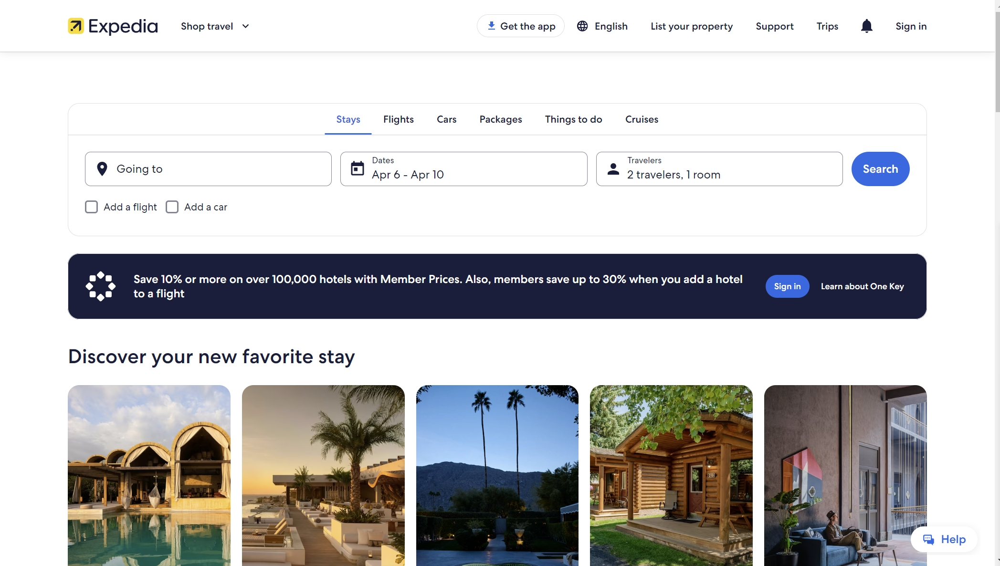

```{r setup, include=FALSE}
knitr::opts_chunk$set(echo = TRUE)
```

## Introduction

This assignment is to find an interesting recommender system and analyze. I choose to analyze Expedia, a well-known online travel booking platform that offers services such as flights, hotels, and car rentals to users. Especially after the COVID-19 pandemic, there has been a significant surge in people's demand for travel after being suppressed for a while. Expedia's recommender system often surfaces travel options people may not have initially considered, expanding choices and potentially leading to better deals or experiences.





## Scenario Design Analysis

### 1.Who are the target users?


The target users of Expedia are travelers seeking convenience and detailed information when booking flights, hotels, car rentals, vacation packages, and other travel-related services online. These travelers come from diverse demographics and backgrounds, reflecting a shift away from traditional travel agencies towards online platforms for their booking needs.


### 2.What are their key goals?


The key goals of Expedia's users include finding the best deals on flights and accommodations, simplifying the booking process, and ensuring a smooth travel experience.


### 3.How can you help them accomplish those goal?


Expedia helps users accomplish these goals by providing personalized recommendations based on their search history, preferences, and past booking behavior. The recommender system suggests relevant flights, hotels, and activities tailored to each user's needs, making it easier for them to find and book their ideal travel arrangements. Additionally, Expedia offers features such as price alerts, flexible date searches, and user reviews to further assist users in planning their trips effectively.


## Reverse Engineer

Based on the Expedia website interface and available information, it appears that Expedia utilizes content-based filtering and dynamic recommendation Updates in several ways:

***Content-based Filtering***: To analyze the characteristics and attributes of travel destinations, accommodations, and activities to recommend relevant options to users. By considering factors such as location, amenities, pricing, and user ratings, Expedia can suggest tailored recommendations that align with users' preferences and requirements.

***Dynamic Recommendation Updates***: Expedia's recommendation system likely incorporates dynamic updates based on real-time user interactions and feedback. As users browse and interact with the website, the recommendation algorithms continuously adapt and refine their suggestions to reflect changing user preferences and market trends. For example, if a user searches for hotels in a particular city multiple times, Expedia may adjust its recommendations to prioritize listings that align with the user's search history and preferences.


## Recommendations


To enhance Expedia's recommendation capabilities, it is recommended to explore the integration of external data sources. This could involve incorporating trending hotspots, particularly those popularized by platforms such as TikTok, YouTube, and prominent locations featured in movies and television shows, into the recommendation algorithms. In long run for integration of external data sources, Expedia can integrate external data sources such as social media, travel blogs, and review platforms to gather additional insights into user preferences and trends. By analyzing publicly available data, Expedia can further refine its recommendation algorithms and provide more relevant suggestions to users.


## Conclusion


In summary, Expedia's recommender system plays a vital role in enhancing user experience and driving transaction volume on the platform. By leveraging machine learning models and content-based filtering techniques, Expedia effectively tailors recommendations to individual users based on their preferences, search history, and behavior. Even I found myself tempted to book a trip during this review!


## References

https://towardsdatascience.com/predicting-hotel-bookings-on-expedia-d93b0c7e1411


